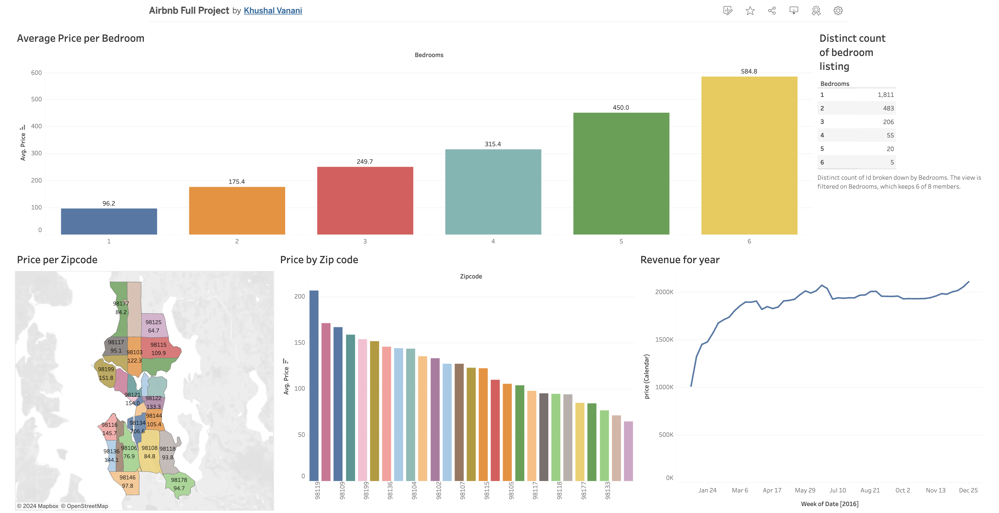

# Airbnb Data Analysis with Tableau

## Overview
This project presents an in-depth analysis of Airbnb listings data using Tableau. By visualizing key metrics such as pricing, availability, and revenue trends, this analysis helps Airbnb hosts, investors, and guests make data-driven decisions to optimize their listings and bookings.

The dashboard created in this project explores relationships between various factors, including the number of bedrooms, location (zip code), and yearly revenue trends.

## Key Insights
### 1. **Average Price per Bedroom**
   - The dashboard visualizes the average price of Airbnb listings based on the number of bedrooms.
   - **Insight**: Listings with more bedrooms tend to have a higher average price, with a notable increase as the bedroom count rises.

### 2. **Price per Zip Code**
   - Mapped out pricing trends based on geographical locations using zip codes.
   - **Insight**: Significant variation in pricing is observed across different zip codes, with some neighborhoods commanding premium prices.

### 3. **Revenue for the Year**
   - Visualized revenue trends over the course of a year to identify high-performing months and seasonal patterns.
   - **Insight**: The trend line shows spikes in revenue during peak travel seasons, indicating opportunities for strategic pricing during high-demand periods.

### 4. **Distinct Count of Bedroom Listings**
   - Analyzed the distribution of listings based on the number of bedrooms.
   - **Insight**: Most listings are concentrated in 1-bedroom categories, but higher-bedroom properties also represent substantial revenue potential.

## Tools Used
- **Tableau**: Used for creating interactive dashboards and data visualization.
- **Airbnb Dataset**: The dataset was downloaded from Kaggle. Due to its large size, the data is not uploaded in this repository. You can access the dataset from Kaggle [here](https://www.kaggle.com/datasets/alexanderfreberg/airbnb-listings-2016-dataset).

## Visualizations
The Tableau dashboard includes:
1. **Average Price per Bedroom**: A bar chart showing the relationship between the number of bedrooms and the average listing price.
2. **Price per Zip Code**: A geographical map and bar chart highlighting how prices vary across different regions.
3. **Revenue for the Year**: A time-series chart depicting total revenue trends over time (broken into weeks).
4. **Distinct Count of Bedroom Listings**: A table summarizing the number of listings categorized by bedroom count.

## How to Access the Tableau Dashboard
The full Tableau dashboard can be accessed [here](https://public.tableau.com/app/profile/khushal.vanani/viz/AirbnbFullProject_17249641053050/Dashboard1) .

## Dashboard Screenshot


## Conclusion
This project provides a comprehensive analysis of Airbnb listings, offering valuable insights for optimizing rental pricing and understanding market dynamics. By leveraging interactive visualizations, stakeholders can make informed decisions regarding pricing strategies, location investment, and revenue maximization.

## Project Folder Structure
```bash
├── Tableau_Dashboard.twb         # Tableau workbook file
├── images/                      # Folder containing screenshot of the dashboard
└── README.md                    # Project readme file
```

## Contact Information
For any questions or collaborations, feel free to reach out via [LinkedIn](https://www.linkedin.com/in/khushal-vanani-8419a7212/) or [Email](khushalvanani9@gmail.com).
